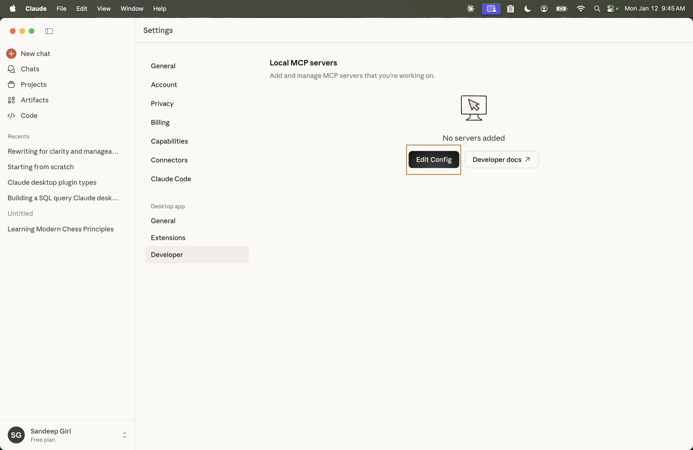

# TernoDBI: Database Interface Layer

[](https://opensource.org/licenses/Apache-2.0)
[](https://www.python.org/downloads/)
[](https://www.djangoproject.com/)

**TernoDBI** is a robust, security-focused database interface layer designed to provide a unified API for interacting with multiple database backends (PostgreSQL, MySQL, Snowflake, BigQuery, Databricks, Oracle, SQLite). It integrates **SQLShield** for advanced query validation and security, and natively supports the **Model Context Protocol (MCP)** for seamless AI agent integration.

---

## Key Features

*   **Multi-Database Support**: Unified connection handling for Postgres, MySQL, Snowflake, BigQuery, Databricks, Oracle, and SQLite.
*   **Split MCP Architecture**:
    *   **Query Server**: Read-only operations (list tables, schema info, execute SELECT queries) optimized for agents.
    *   **Admin Server**: Write/Management operations (rename tables, update metadata, manage descriptions) for human-in-the-loop workflows.
*   **Security First**:
    *   **SQLShield Integration**: Automatic AST-based SQL validation to prevent injection and enforce read-only policies.
    *   **Service Tokens**: Granular API key authentication with expiration and datasource scoping.
    *   **Row Level Security**: Configurable row-level filters and column masking.
*   **Enterprise Pagination**:
    *   **Cursor-Based**: O(1) performance for deep datasets with HMAC-signed cursors.
    *   **Streaming**: Server-side cursors for exporting millions of rows with low memory usage.

---

## Documentation

Detailed guides for setting up and using TernoDBI:

*   **[Setup Guide](docs/setup.md)**: Installation, Environment Variables, and Server Startup.
*   **[Architecture](docs/architecture.md)**: System design, request flow, and component breakdown.
*   **[MCP Integration](docs/mcp-guide.md)**: How to connect agents (Claude Desktop, Terno Agents).
*   **[Security & SQLShield](docs/security.md)**: Deep dive into our security model and token system.

---

## Installation

To install TernoDBI and all supported database drivers:

```bash
pip install terno-dbi
# OR for local development
pip install -e .
```

---

## Configuration

TernoDBI uses environment variables for configuration. Copy the sample file to start:

```bash
cp server/env-sample.sh server/env.sh
# Edit server/env.sh with your production keys
source server/env.sh
```

### Essential Variables

| Variable | Description | Default |
| :--- | :--- | :--- |
| `DBI_SECRET_KEY` | Django Secret Key | Unsafe Default |
| `DBI_DEBUG` | Debug Mode | `True` |
| `DATABASE_ENGINE` | `MYSQL`, `POSTGRESQL`, or empty (SQLite) | `SQLite` |

### Database Setup

*   **Standalone SQLite**: Just set `DATABASE_ENGINE=` (empty). DB created in `server/db.sqlite3`.
*   **Shared SQLite (Embedded)**: Set `DJANGO_PROJECT_PATH=/path/to/other/django`. TernoDBI will attach to that project's database.
*   **Production (Postgres/MySQL)**: Set `DATABASE_ENGINE=POSTGRESQL` and provide `POSTGRES_DB`, `POSTGRES_USER`, etc.

---

## Usage

### 1. Running the API Server

```bash
cd server
python manage.py migrate
python manage.py runserver 0.0.0.0:8000
```

### 2. Management Commands

**Create an API Key (Service Token):**

```bash
# General Query Token
python manage.py issue_token --name "My Agent" --type query --expires 30

# Admin Token (Full Access)
python manage.py issue_token --name "Admin User" --type admin

# Scoped Token (Specific Datasource)
python manage.py issue_token --name "DWH Only" --type query --datasource 1
```

### 3. Pagination Features

TernoDBI supports two pagination modes:

**Offset Mode (Default)**
Best for UI with page numbers.
```bash
POST /api/query/datasources/1/query/
{
    "sql": "SELECT * FROM users",
    "pagination_mode": "offset",
    "page": 2,
    "per_page": 50
}
```

**Cursor Mode (High Performance)**
Best for infinite scrolling and large exports. O(1) performance.
```bash
POST /api/query/datasources/1/query/
{
    "sql": "SELECT * FROM users",
    "pagination_mode": "cursor",
    "per_page": 50,
    "cursor": "eyJ2IjoxLCJ2YWx1ZXM..."  # From previous response
}
```

---

## MCP Server Integration

TernoDBI exposes two MCP servers for AI agents (like Claude Desktop or Terno Agents).

### Claude Desktop Setup

#### Step 1: Download & Install Claude Desktop

Download Claude Desktop from [https://claude.ai/download](https://claude.ai/download) and install it on your machine.

#### Step 2: Open Configuration

1. Launch Claude Desktop
2. Go to **Account** → **Settings**
3. Navigate to **Developer** section
4. Click **Edit Config** to open `claude_desktop_config.json`



#### Step 3: Add MCP Server Configuration

Add the following configuration to your `claude_desktop_config.json`:

#### Local Development
```json
{
  "mcpServers": {
    "ternodbi-admin": {
      "command": "/path/to/your/venv/bin/dbi-mcp",
      "args": ["admin"],
      "env": {
        "TERNODBI_API_URL": "http://127.0.0.1:8000",
        "TERNODBI_API_KEY": "dbi_admin_..."
      }
    },
    "ternodbi-query": {
      "command": "/path/to/your/venv/bin/dbi-mcp",
      "args": ["query"],
      "env": {
        "TERNODBI_API_URL": "http://127.0.0.1:8000",
        "TERNODBI_API_KEY": "dbi_query_..."
      }
    }
  }
}
```

> [!TIP]
> Run `which dbi-mcp` in your terminal to find the absolute path to use in the configuration above.

#### Production (using uvx)
```json
{
  "mcpServers": {
    "ternodbi-query": {
      "command": "uvx",
      "args": ["--from", "terno-dbi", "dbi-mcp", "query"],
      "env": {
        "TERNODBI_API_URL": "https://dbi.yourdomain.com",
        "TERNODBI_API_KEY": "dbi_query_..."
      }
    }
  }
}
```

#### Step 4: Restart & Verify

1. Save and close the `claude_desktop_config.json` file
2. **Completely quit** Claude Desktop (not just close the window)
3. Reopen Claude Desktop
4. Go to **Settings** → **Developer** to verify your MCP servers are listed
5. Start a new chat and test with: *"Show me all datasources"*

> [!TIP]
> If the MCP servers don't appear, check the Claude Desktop logs for connection errors.
> Make sure your TernoDBI server is running and accessible at the configured URL.

---

## Development

### Running Tests
```bash
pytest
```

---

## License

Apache 2.0 - See [LICENSE](LICENSE) for details.
