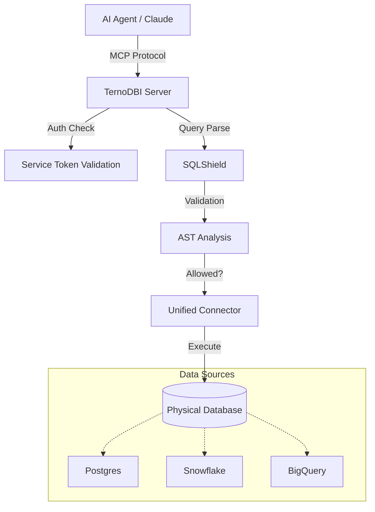

# Architecture Overview

TernoDBI is designed as a **Database Interface Layer** that sits between your AI Agents and your physical data warehouses. It solves the "last mile" problem of letting LLMs query databases securely.

## System Diagram

## Core Components

### 1. The MCP Layer
TernoDBI exposes two distinct servers via the [Model Context Protocol](https://modelcontextprotocol.io/):
*   **Query Server**: Read-only. Exposes tools like `list_tables`, `get_schema`, and `execute_sql`. Designed for safety.
*   **Admin Server**: Write-access. Exposes tools like `rename_table`, `update_description`. Designed for human-in-the-loop curation.

### 2. SQLShield
The security engine. It parses every incoming SQL query into an Abstract Syntax Tree (AST) using `sqlglot`.
*   **Validation**: Rejects mutations (`INSERT`, `DROP`, `ALTER`).
*   **Transformation**: Can rewrite queries (e.g., forcing `LIMIT`, applying Row Level Security).
*   **Dialect Translation**: Converts generic SQL into database-specific dialects (e.g., handling BigQuery backticks vs Postgres quotes).

### 3. Unified Connector System
A factory-based abstraction over `SQLAlchemy` and native drivers.
*   Application code (and Agents) interact with a single `Connector` interface.
*   TernoDBI handles the complexity of connection pooling, cursor management, and type conversion for each backend.

### 4. Service Token Authentication
A custom authentication system designed for agents.
*   **Scopes**: Tokens can be global or restricted to specific Datasource IDs.
*   **Expiration**: Tokens can be short-lived (e.g., ephemeral tokens for a specific chat session).
*   **Audit**: Usage is tracked per-token.
